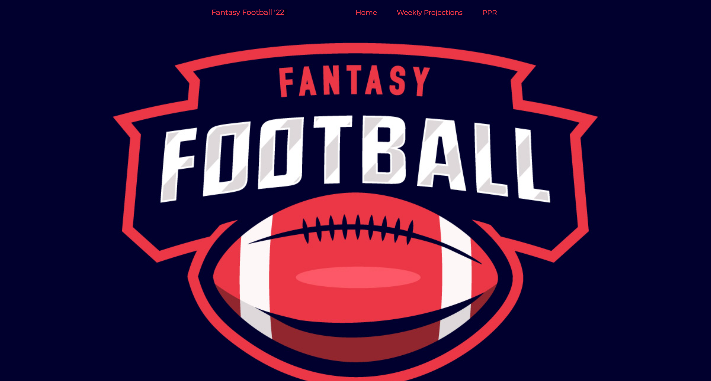
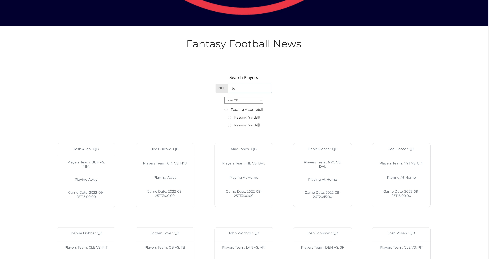

# :checkered_flag:What It Looks Like :checkered_flag::

# How It's Made :nut_and_bolt:🔨 :hammer::wrench::

This application is built with React, Semantic UI, & Sportsdata.io API.

# How It's Works:white_check_mark::🖥 & Lessons Learned :mortar_board:

A user can get the most recent fantasy football news from Rotoworld Fantasy Pros; search for their favorite player for projections for the following games and average stats per game.

I created the pages on the website from three main components, FantasyFootballRanking, WeeklyProjections, and PPR, with two different API calls to Sportsdatas' API. Finding a way to deploy my API key with the app was initially tricky with Netlify, but I found it in their new variable key, like any .env file.

Styling these pages became easy with Semantic UI and Style-Components. I made a card component using Styled Components that will populate the data on individual cards once the promise comes back. The user can filter thru the players by name by typing in the input or selecting the position in the input selection options.

Managing the API in the global state was easy using a React Hook called useContext; In React, they created Hooks, functions that let you "hook into" React state and lifecycle features from function components rather than the Class-based OOP style. So finally, hooks provide a more direct API to the React concepts you already know: props, state, context, refs, and lifecycle. And just like Redux, you can create a provider with a value object that's all the data you want to pass to your components.
# Portfolio :open_file_folder::

** :computer: 🇭🇹 WEBSITE:** [John Fleurimond](https://johnfleurimond.netlify.app)

## Installation

1.  Clone repo
2.  run `npm install`
(Note: You need your own key and `.dotenv` file for this to work.)

# How To Get It Started :arrow_forward: :

In the project directory, you can run: `npm run dev`

# Demo :video_game:

https://fantasyfootball22.netlify.app/
